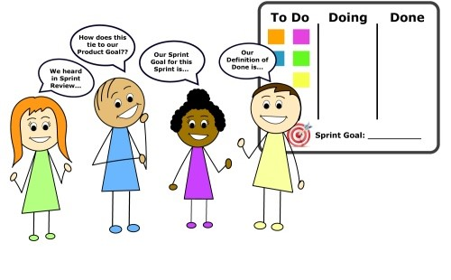

# Agile
* [Lesson objective](#lesson-objective)
* [What is Agile Development?](#what-is-agile-development)
* [Scrum](#scrum)
  * [What is scrum?](#what-is-scrum)
  * [Why scrum?](#why-scrum)
  * [Scrum master](#scrum-master)
  * [Sprints and sprint ceremonies](#sprints-and-sprint-ceremonies)
* [Practice](#practice)

## Lesson objective
* Quickly learn Agile Development concepts, terms, and commands
* Reinforce theory with some quizzes

## What is agile development?
Agile software development is an iterative and incremental approach to software development. The goal of agile development is to give teams the ability to create and respond to change. It is a way of dealing with, and ultimately succeeding in, an uncertain and turbulent environment. 

You may ask, 'what and why are we working in uncertain and turbulent environments'? As discussed previously, modern businesses are software driven and this demand creates a highly competitive and unpredicatble technology sector as teams work to push their feature to market quicker, address bugs, etc. An approach such as [water-fall software development](https://en.wikipedia.org/wiki/Waterfall_model) is simply outdated and can't meet the demands of modern tecnology industries.

Agile software development is broken down into two main part:
* an agile (iterative and incremental) approach to managing projects
* an agile (iterative and incremental) approach to development

## Scrum
### What is scrum?
**Scrum is an agile (iterative and incremental) approach to project management**. Scrum is a subset/discipline within Agile project management that helps teams structure and manage their work through a set of values, principles, and practices. People often ask, "Is Scrum an acronym for something?" and the answer is no. It is actually inspired by a scrum in the sport of rugby. In rugby, the team comes together in what they call a scrum to work together to move the ball forward. In this context, Scrum is where the team comes together to move the product forward.

Scrum is not the only methodology within agile framework, but it's the most adopted within the tech sector. Here're a few of the other types of methodologies within the agile umbrella.
* Kanban
* Extreme Programming (XP)
* Lean Development
* Scaled Agile Framework (SAFe)

### Why scrum?
The scrum method has gained popularity within tech industry because it allows teams to self-manage, learn from experience, and adapt to change. These become competitive advantages when a team is very product/software development focused. Scrum therefore fits perfectly as a project management method for technology projects and it helps teams address the challenges mentioned earlier.

### Scrum master?
The scrum master is someone who is an expert at using the scrum method to deliver and manage projects. The scrum master role is a subset or type of project management role.

Here're some responsibilities of a scrum master:
* both a facilitator and coach who helps the team understand and apply scrum theory and practice.
* helps teams work more effectively by skillfully removing obstacles and distractions that may impede the team from meeting goals
* facilitate meetings to plan work, track progress, and discuss lessons learned.

### Sprints and sprint ceremonies
A 'sprint' is a short time period (typically two week period) when a scrum team works to complete a set amount of work. 

Within a 'sprint' there are ceremonies. The term 'sprint ceremony' comes from the concept of celebrating key milestones within the sprint. However, they're less about celebrations and more about establishing consistent checkpoints in a project’s lifecycle. These ceremonies are essentially meetings when the scrum team meet to plan work, discuss work in progress, gather feedback, and more.

Here're the sprint ceremonies (meetings):
* **Sprint planning**: plan out what work will be completed during the upcoming sprin
* **Daily standup**: daily meeting for the team to update each other on their task progress
* **Sprint review**: opportunity for the development team to receive feedback from key stakeholders of a project
* **Sprint retrospective**: opportunity for team members to reflect on the past sprint
* **Backlog refinement**: identify work and estimate the level of effort (as a group)

 <small><i>image: https://www.agilesherpas.com</i></small>

Let's get more details on each sprint ceremony:

#### Sprint planning
* What happens in this meeting? Sprint planning is when the team takes time to plan out what work will be completed during the upcoming sprint. These items are traditionally pulled from the product backlog (commonly reffered to as 'backlog'), however they may also come up as new tasks.

* When does this ceremony happen? Sprint planning occurs at the beginning of each sprint.

* Who's involved? Typically the sprint planning session has a bigger audience consisting of product owners, scrum master, and development team.

* What is the expected outcome of this ceremony? By the end of sprint planning everybody on the team should know what the goal of the sprint is; meaning what tasks are to be completed and what tasks are placed in the backlog for later.

* How long does this ceremony take? Sprint planning sessions typically take 1 hour, however I've seen some take 4 hours; especially in larger teams with more complex initiatives.
<!--
 <small><i>image: https://www.scrum.org</i></small>
-->

#### Daily standup
* What happens in this meeting? Daily stand-up (also known as 'daily scrum') is a daily meeting for the team to update each other on their task progress; what they completed yesterday, what they're working on today, and if they have any blockers in their way.

* When does this ceremony happen? As the name implies, daily stand-up occurs once daily, typically in the morning before team members dive into their work.

* Who's involved? Daily stand-up typically has a smaller audience than a sprint planning session. In most cases it consist of the scrum master and development team.

* What is the expected outcome of this ceremony? The intended goal here is for everyone on the development team to touch base with each other. If there're any blockers then the Scrum master will get involved to help clear that.

* How long does this ceremony take? Typically this is a quick status check that should only take 15-30 minutes.

### Sprint review
* What happens in this meeting? Sprint review is an opportunity for the development team to receive feedback from stakeholders of a project. The goal of this meeting is to receive feedback on work the development team completed during that sprint. The Scrum master organizes the meeting, showcases the teams completed work, and facilitates questions from external stakeholders who are not on the development team.

* When does this ceremony happen? Sprint review happens at the end of the sprint when all tasks are completed, but before the sprint retrospective occurs.

* Who's involved? The development team, Scrum master, and product owner are all required to attend this meeting.

* What is the expected outcome of this ceremony? This meeting is an opportunity for stakeholders to give feedback and ask questions about the end product. The Scrum master may use this opportunity to work with stakeholders to figure out if the product backlog needs adjustment.

* How long does this ceremony take? Similar to sprint planning, this meeting should last about an hour. However, I've also seen Sprint review sessions that last up to 4 hours.

### Sprint retrospective
* What happens in this meeting? Sprint retrospective (also known as 'retro') is an opportunity for team members to reflect on the past sprint and think about what went well and what could be improved for next time. Unlike a sprint review which focuses on the product, the sprint retro focuses on the process.

* When does this ceremony happen? Sprint retro happens at the very end of a sprint; typically after a sprint review meeting.

* Who's involved? Sprint retros consist of development team and Scrum master. Anybody who actively worked on tasks throughout the sprint should attend this meeting.

* What is the expected outcome of this ceremony? The goal of this ceremony is to identify key points for iteration (process improvement). If team members can find something to change and improve for the upcoming sprint then they should share that with the entire team. Agile methodology relies on continuous improvement, and retrospectives are an integral part of that process. Also, this is a time to give shout-outs to team members for their help/achivements during the sprint; everybody likes when their efforts are acknowleged and appreciated.

* How long does this ceremony take? Sprint retro meetings are typically 1 hour.

### Baclog refinement
Backlog ~~grooming~~ refinement is about creating shared understanding on what the product will and won’t do, as well as the effort it will take to implement it. Backlog refinement used to be called 'backlog grooming', however the name changed because grooming became a dirty word that is not tolerated by most companies. Backlog refinement is an ongoing activity during the sprint, however some organizations like to have a dedicated ceremony for this (depending on the complexity of their initiatives). Think of this as a session for teams to identify work and estimate the level of effor (LOE) as a group.

## Practice
* [My first repo](proj-01-my-first-repo.md)
* [Sync local with remote repo](proj-02-fetch-pull.md)
* [Working with branches](proj-03-branch.md)
* [Merging branches](proj-04-merge.md)
