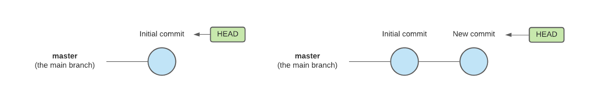

# Agile
* [Lesson objective](#lesson-objective)
* [What is Agile Development](#what-is-agile-development)
* Scrum
  * [What is scrum](#what-is-scrum)
  * [Why scrum](#why-scrum)
* [Practice](#practice)

## Lesson objective
* Quickly learn Agile Development concepts, terms, and commands
* Reinforce theory with some quizzes

## What is agile development?
Agile software development is an iterative and incremental approach to software development. The goal of agile development is to give teams the ability to create and respond to change. It is a way of dealing with, and ultimately succeeding in, an uncertain and turbulent environment. 

You may ask, 'what and why are we working in uncertain and turbulent environments'? As discussed previously, modern businesses are software driven and this demand creates a highly competitive and unpredicatble technology sector as teams work to push their feature to market quicker, address bugs, etc. An approach such as [water-fall software development](https://en.wikipedia.org/wiki/Waterfall_model) is simply outdated and can't meet the demands of modern tecnology industries.

Agile software development is broken down into two main part:
* an iterative and incremental approach to managing projects
* an iterative and incremental approach to development (code)

## Scrum
### What us scrum?
Scrum is a subset/discipline within Agile project management that helps teams structure and manage their work through a set of values, principles, and practices. People often ask, "Is Scrum an acronym for something?" and the answer is no. It is actually inspired by a scrum in the sport of rugby. In rugby, the team comes together in what they call a scrum to work together to move the ball forward. In this context, Scrum is where the team comes together to move the product forward.

Scrum is not the only methodology within agile framework, but it's the most adopted within the tech sector. Here're a few of the other types of methodologies within the agile umbrella.
* Kanban
* Extreme Programming (XP)
* Lean Development
* Scaled Agile Framework (SAFe)

### Why scrum?
The scrum method has gained popularity within tech industry because it allows teams to self-manage, learn from experience, and adapt to change. These become competitive advantages when a team is very product/software development focused. Scrum therefore fits perfectly as a project management method for technology projects and it helps teams address the challenges mentioned earlier.


Git is an open-source command line Version Control System (VCS) originally developed in 2005 by Linus Torvalds (the guy who created Linux os/kernel). There're a few VCS's in the market, but Git has become the clear leader because it's the engine behind many popular source control tools such as Github, Gitlab, Bitbucket. Also, the Git engine works well on a wide range of operating systems and IDEs (Integrated Development Environments). Git helps teams work faster and smarter; it's especially useful for DevOps teams since it helps to reduce development time and increase successful deployments.

Git (also known as source control) is used to track and manage changes to code. Like other version control software, Git keeps track of every modification to code. If a mistake is made, you can turn back the clock and compare earlier versions of the code to help fix the mistake while minimizing disruption to all team members. Git does alot, but here're a few important things to know about Git:

* Git keeps track of every modification to source code
* Git support ability to rollback to previous versions of source code
* Git allows multiple developers to work collaboratively

## Git vs GitHub vs GitLab
You've probably heard of Github or GitLab, and you may even wonder how are they different from Git. Simply put, Git is the engine behind GitHub and GitLab. Both GitHub and GitHub are web-based VCS that've put nice UI ontop the native Git engine. If you want, you can use GitHub or GitLab from the user friendly website (no git commands needed), however if you are a geek like me then you'd prefer the git command line. Git commands are the same regardless if you are using GitHub, GitLab, Bitbucket, or any other VCS running on git. The only thing that is different is the UI, a few terminilogies and functionalities. For example GitHub's CI/CD feature is called 'GitHub Action' where as GitLab's CI/CD is called "GitLab CI'. My advice to you is to learn git commands because their transferrable accros any git-powered VCS.

## Basic Git terminology
Let's get familiar with some common git terms.

* **Repository (repo)**: A Git repository acts as a directory that stores all the content (code, files, images, etc) needed for your project.
* **Init**: `git init` command is used to start tracking a directory, which means it's now a git repo.
* **Clone**: `git clone` command is used to copy a repo.
* **Branch**: A branch is a version of the repo.
* **Checkout**: `git checkout` command is used switch between branches in a repo.
* **Commit**: `git commit` creates a saves modifications made to repo. It essentially crrates a savepoint/napshot of the repo. The latest commit is known as the 'head' of the branch.
* **Merge**: `git merge` command incorporates changes from specified commits into the current branch.
* **Local repo**: Local repos reside on the computers of team members.
* **Remote repo**: Remote repos are hosted on a server accessible for all team members (most likely on the internet or local network).
* **Pull**: `git pull` command grabs changes from a remote repo into the current branch of your local repo.
* **Fetch**: `git fetch` command get changes from a remote repo but it doesn't integrate any of the changes into your working files.
* **Push**: `git push` command updates a remote repo with the commits made to the locl repo.
* **Status**: `git status` command shows the working tree status; what files have been modifed, marked to be saved, and which files aren't being tracked in repo. 

## Git states
Git has three main states that your files can reside in; modified, staged, and committed.

* **Modified**: means that you've made changes to your file but have'nt staged it yet. The modified file is logical place in 'Working Directory'.
* **Staged**: means that you have marked a modified file to be added to your next commit. Staged files are logically placed in 'Staging Area'.
* **Committed**: means that staged file has been successfully saved to git database. Committed files are logicallt placed in 'Git Directory'.

<p align="center"><br/><small><i>image: https://git-scm.com</i></small></p>

## Branches
A Git branch is essentially a copy of the code base. Branches allow you to work of changes (such as different features, issues, or bug fixes) without affecting the project's main codebase.

Each repo contains a default branch called 'main'; the 'main' branch ideally should contain a stable version of your codebase. You may see older repos refer to this deafult branch as 'master', however newer repos typically default to 'main'. Anyway, 'main' or 'master' ... it does'nt matter because they are both the same in the same that it they represent the default branch of a repo and should contain stable copies of codebase.

Every commit in a branch creates a new 'head' for that branch. HEAD is the reference to the most recent commit in the current branch; this means HEAD is just like a pointer that keeps track of the latest commit in your current branch. (see diagram below). Note, circles are used to signify a commit in Git branch workflow diagrams.

<p align="center"><br/><small><i>image: https://codeinstitute.net</i></small></p>

The `git checkout` command is used to switch from one branch to another within a repo.

## Merge
In the most frequent use-cases, `git merge` is used to combine two branches. When creating a merge, Git will attempt to auto magically merge the separate branch histories for you. If Git encounters a piece of data that is changed in both histories it will be unable to automatically combine them. This is known as a merge conflict and you'll need to resolve the conflict to continue. 

Say we have a new branch called 'navbar' that is based off the 'main' branch. We're done adding our changes and now want to merge this 'navbar' branch into 'main'.

<p align="center"><br/><small><i>image: https://codeinstitute.net</i></small></p>

## Git pull vs fetch
`git pull` and `git fetch` are very similar (and misleading to some). The key difference between git fetch and pull is that git pull copies changes from a remote repo directly into local repo git working directory, while git fetch does not. The git fetch command essentially only copies changes but it does not apply them. The git pull command does both.

If your workspace has no uncommitted files, and you want to copy the latest changes from a remote repo directly into your local working directory, then issue the git pull command.

If you want to pull down the latest changes from a remote repo without overwriting anything in your working directory, then use git fetch, and then do a git merge when the time is right.

<p align="center"><br/><small><i>image: https://www.theserverside.com</i></small></p>

Fetch is great for getting a fresh view on all the things that happened in a remote repository. Due to it's "harmless" nature, you can rest assured fetch will never manipulate, destroy, or screw up anything. This means you can never fetch often enough.

## Setup your practice environment
1. We'll be using GitHub as our remote repo. [Create a GitHub acoount (it's free).](https://github.com/join)
1. We'll be using Git Bash as our emulation layer for Git command line. [Download and install Git Bash (it's free).](https://git-scm.com/downloads)
1. [Setup access and write data in repositories on GitHub.com using SSH.](https://docs.github.com/en/authentication/connecting-to-github-with-ssh/adding-a-new-ssh-key-to-your-github-account)
1. setup your identity (username & email) in Git Bash. This is important because every Git commit uses this information. You need to do this only once if you pass the `--global` option, because then Git will always use that information for anything you do on that system. 
```
# in this example, I'm setting git username to 'Mike Jones'...(please put your GitHub username)
$ git config --global user.name "Mike Jones"

# in this example, I'm setting git email to 'mjones@who.com' ...(please put your GitHub email)
$ git config --global user.email mjones@who.com

# confirm your global git identity on Git Bash has been setup correct
$ git config --global user.name
$ git config --global user.email
```

## Practice
* [My first repo](proj-01-my-first-repo.md)
* [Sync local with remote repo](proj-02-fetch-pull.md)
* [Working with branches](proj-03-branch.md)
* [Merging branches](proj-04-merge.md)
