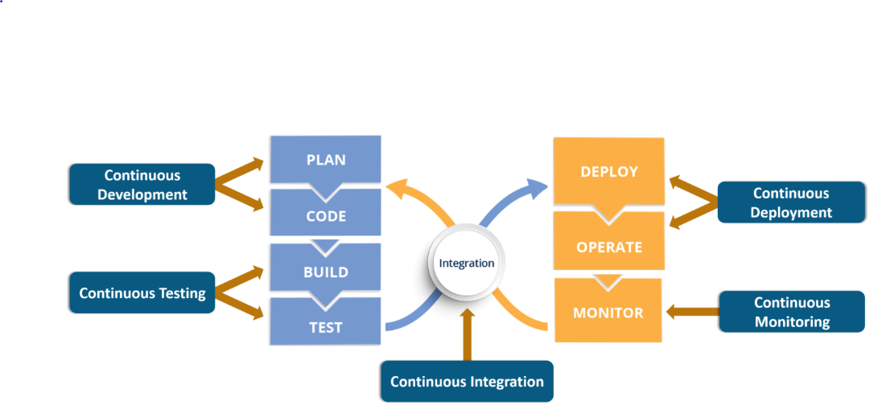
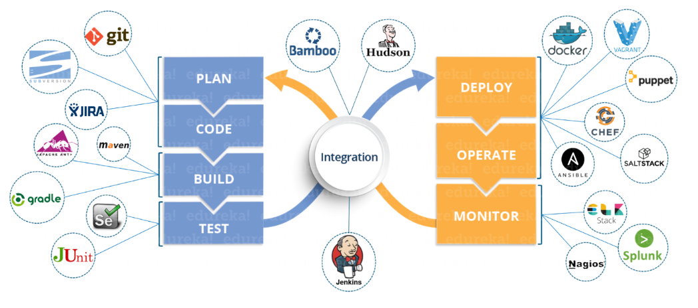

# DevOps
* [Lesson objective](#lesson-objective)
* [What is DevOps?](#what-is-devops)
* [DevOps vs Scrum](#devops-vs-scrum)
* [DevOps Framework](#devops-framework)
* [Why DevOps?](#why-devops)
* [SDLC for DevOps](#sdlc-for-devops)
  * [Why scrum?](#why-scrum)
  * [Scrum master](#scrum-master)
  * [Sprints and sprint ceremonies](#sprints-and-sprint-ceremonies)
* [Summary](#summary)

## Lesson objective
* Quickly learn about waterfall vs agile
* breakdown scrum concepts

## What is DevOps?
Let's start by establishing that DevOps is an agile approach to software development. This means that DevOps uses agile principles to build and deploy software to market quickly:
* continuous releases and incorporate feedback with every iteration
* strongly advocate automation and monitoring at all steps of software construction
* focus on shorter development cycles (quicker release)
* increased deployment frequency (frequent deploy)
* dependable releases in close alignment with business objectives

Ok now let's get more technical. As stated above, DevOps is a type of agile methodology for software development. DevOps unites the often separate functions of software development (Dev) and production operations (Ops) into a single, integrated, and continuous process. DevOps is about breaking down the barriers between Dev and Ops. It leverages people, processes, and technology to stimulate collaboration and innovation across the entire software development and release process. Dev and Ops must act and feel like they are a single team. 

DevOps is a framework, a mind-set, a philosphy, a culture ... DevOps is logical. I see a good number of people mistakingly say that they're doing "DevOps" beause they're using certain tools. Let me make this point clear; tools alone does not make you a devops shop. Being a DevOps shop or 'doing DevOps' requires a combination of cultural philosophies, practices, and tools. 

## DevOps vs Scrum
We discussed [scrum in the previous section](scrum.md). If you remember, scrum is an agile approach to managing projects. Here we're talking about DevOps; an agile approach to software development. Although they are very similar in nature, they differ in focus areas:

**Similarities**
* Scrum and DevOps are both agile

**Differences**
* Scrum is for agile PMs (project managers using adaptive project management approach)
* DevOps is for agile Devs (developers using continous integration to deliver software)

Both DevOps and Scrum frameworks are tightly integrated, however, this does not make them the same; they're focused on different areas of the product delivery to market.

## DevOps Framework

 <small><i>I forgot where I got this image</i><small>

## Why DevOps?
You're probably sick of reading this phrase by now, but just a reminder that modern businesses are software driven. This is why DevOps is quickly becoming one of the most valuable disciplines in technology as well as business. DevOps leverages automation to focus on:
* improve the quality of software
* improve the speed of software to market
* tightly integrating development and operations

### :x: Nope to waterfall
Without going into too much details, the traditional waterfall approach to software development obviously does not meet the need of modern tech sector:
* waterfall software development framework is not adaptive to changes
* too slow to develop and deliver product to market
• defects aren’t discovered until late in the cycle

### :x: Nope to traditional agile
Likewise the traditional agile approach to software development also falls short of meeting the demands of modern businesses:
* great at getting product developed but lacks agility in operations
* no clear hand-off to Ops
* only focused on speed of devlopment (forgot about ops)

### :heavy_check_mark: Yay to DevOps
This where DevOps (an extension of agile software development) comes in to address modern concern; dev and ops.

**Address concerns of Dev**
* focused on innovation and new feature adds
* releasing bug fix and correcting defects

**Address concerns of Ops**
* want predictability
* focused on keeping systems up to PAR (performance, availability, recoverability)

## SDLC for DevOps

 <small><i>I forgot where I got this image</i><small>

The software development life cycle (SDLC) for DevOps combines the principles and practices of both software development and operations to ensure faster, more reliable, and continuous delivery of software. The DevOps SDLC emphasizes automation, collaboration, and continuous feedback throughout the entire software development and operations process. It aims to foster a culture of shared responsibility, enable faster time-to-market, and improve overall software quality.

### Plan
In this initial stage, the development team collaborates with stakeholders to define project goals, requirements, and plan the development process. This includes creating a roadmap, prioritizing features, estimating resources, and setting project timelines.

### Code
During this stage, developers write code based on the requirements and design specifications. DevOps teams emphasize the use of version control systems (such as Git) to manage code changes and ensure collaboration among developers. They also follow coding best practices and conduct code reviews to maintain code quality.

### Build
The build stage involves compiling the source code into executable binaries or artifacts. DevOps teams use build automation tools like Jenkins to automate the build process. This ensures consistent and reproducible builds and enables continuous integration (CI) practices.

### Test
Testing is an integral part of the DevOps SDLC. DevOps teams perform various types of testing, such as unit testing, integration testing, system testing, and acceptance testing. Automated testing frameworks and tools are leveraged to enable continuous testing, allowing faster feedback on code changes.

###  Deploy
The deployment stage involves deploying the built artifacts to the target environments, such as development, staging, and production. Infrastructure as Code (IaC) tools like Terraform are used to define and provision the required infrastructure resources. Continuous deployment (CD) practices automate the deployment process, ensuring consistent and reliable deployments.

### Operate
Once the software is deployed, the operations team manages the running systems. Monitoring tools are employed to track system health, performance, and security. DevOps teams use log aggregation and analysis tools to proactively identify and resolve issues. They also focus on automating routine operational tasks, such as scaling, backup, and recovery, to reduce manual effort.

### Monitor
Continuous monitoring is crucial in a DevOps SDLC. Monitoring tools capture metrics, logs, and other relevant data to provide insights into the application's performance, usage, and user experience. Monitoring enables teams to detect anomalies, identify bottlenecks, and make data-driven decisions to improve the software.

> I could not have explained it better so I did'nt waste time trying to. The SDLC for DevOps section is from [Nithin's meduim page](https://nithinguruswamy.medium.com)

## Common Tools in DevOps Shops

 <small><i>I forgot where I got this image</i><small>

## Summary
* traditional agile software development is only concerned with speed of development and neglect hand-off to operations
* DevOps is an extension of agile software development; it address both speed of development (dev) and hand-off to ops (ops)
* DevOps is a framework that requires a change in mindset, skills, and tool to unify dev and ops
