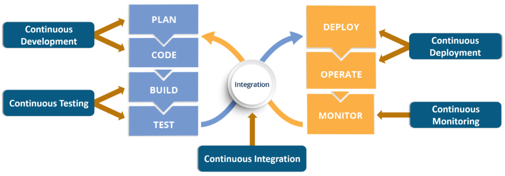
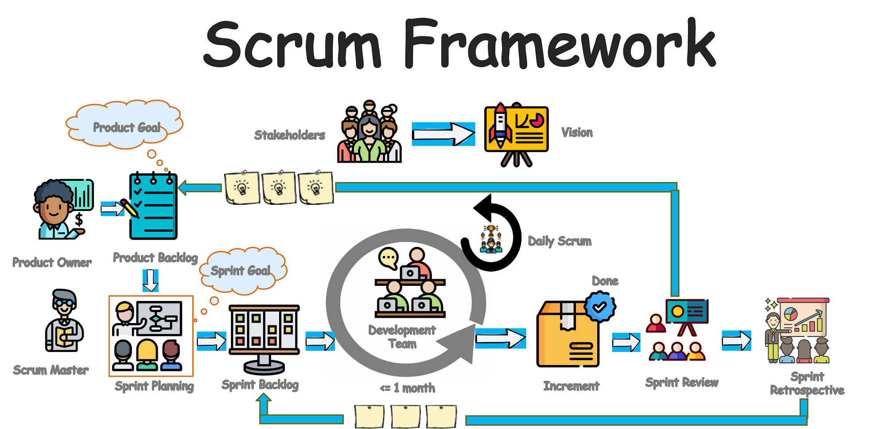

# DevOps
* [Lesson objective](#lesson-objective)
* [What is DevOps?](#what-is-devops)
* [DevOps vs Scrum](#devops-vs-scrum)
* [DevOps Framework](#devops-framework)
  * [Why DevOps?](#why-devops)
  * [SDLC for DevOps](#sdlc-for-devops)
  * [Why scrum?](#why-scrum)
  * [Scrum master](#scrum-master)
  * [Sprints and sprint ceremonies](#sprints-and-sprint-ceremonies)
* [Summary](#summary)

## Lesson objective
* Quickly learn about waterfall vs agile
* breakdown scrum concepts

## What is DevOps?
Let's start by establishing that DevOps is an agile approach to software development. This means that DevOps uses agile principles to build and deploy software to market quickly:
* continuous releases and incorporate feedback with every iteration
* strongly advocate automation and monitoring at all steps of software construction
* focus on shorter development cycles (quicker release)
* increased deployment frequency (frequent deploy)
* dependable releases in close alignment with business objectives

Ok now let's get more technical. As stated above, DevOps is a type of agile methodology for software development. DevOps unites the often separate functions of software development (Dev) and production operations (Ops) into a single, integrated, and continuous process. DevOps is about breaking down the barriers between Dev and Ops. It leverages people, processes, and technology to stimulate collaboration and innovation across the entire software development and release process. Dev and Ops must act and feel like they are a single team. 

DevOps is a framework, a mind-set, a philosphy, a culture ... DevOps is logical. I see a good number of people mistakingly say that they're doing "DevOps" beause they're using certain tools. Let me make this point clear; tools alone does not make you a devops shop. Being a DevOps shop or 'doing DevOps' requires a combination of cultural philosophies, practices, and tools. 

## DevOps vs Scrum
We discussed [scrum in the previous section](scrum.md). If you remember, scrum is an agile approach to managing projects. Here we're talking about DevOps; an agile approach to software development. Although they are very similar in nature, they differ in focus areas:

**Similarities**
* Scrum and DevOps are both agile

**Differences**
* Scrum is for agile PMs (project managers using adaptive project management approach)
* DevOps is for agile Devs (developers using continous integration to deliver software)

Both DevOps and Scrum frameworks are tightly integrated, however, this does not make them the same; they're focused on different areas of the product delivery to market.

## DevOps Framework

 <small><i>I forgot where I got this image</i><small>

### Why DevOps?
You're probably sick of reading this phrase by now, but just a reminder that modern businesses are software driven. This is why DevOps is quickly becoming one of the most valuable disciplines in technology as well as business. DevOps leverages automation to focus on:
* improve the quality of software
* improve the speed of software to market
* tightly integrating development and operations

#### :x: Nope to waterfall
Without going into too much details, the traditional waterfall approach to software development obviously does not meet the need of modern tech sector:
* waterfall software development framework is not adaptive to changes
* too slow to develop and deliver product to market
• defects aren’t discovered until late in the cycle

#### :x: Nope to traditional agile
Likewise the traditional agile approach to software development also falls short of meeting the demands of modern businesses:
* great at getting product developed but lacks agility in operations
* no clear hand-off to Ops
* only focused on speed of devlopment (forgot about ops)

#### :heavy_check_mark: Yay to DevOps
This where DevOps (an extension of agile software development) comes in to address modern concern; dev and ops.

**Address concerns of Dev**
* focused on innovation and new feature adds
* releasing bug fix and correcting defects

**Address concerns of Ops**
* want predictability
* focused on keeping systems up to PAR (performance, availability, recoverability)

### SDLC for DevOps

 <small><i>I forgot where I got this image</i><small>

The software development life cycle (SDLC) for DevOps combines the principles and practices of both software development and operations to ensure faster, more reliable, and continuous delivery of software. The DevOps SDLC emphasizes automation, collaboration, and continuous feedback throughout the entire software development and operations process. It aims to foster a culture of shared responsibility, enable faster time-to-market, and improve overall software quality.

#### Plan
In this initial stage, the development team collaborates with stakeholders to define project goals, requirements, and plan the development process. This includes creating a roadmap, prioritizing features, estimating resources, and setting project timelines.

#### Code
During this stage, developers write code based on the requirements and design specifications. DevOps teams emphasize the use of version control systems (such as Git) to manage code changes and ensure collaboration among developers. They also follow coding best practices and conduct code reviews to maintain code quality.

#### Build
The build stage involves compiling the source code into executable binaries or artifacts. DevOps teams use build automation tools like Jenkins to automate the build process. This ensures consistent and reproducible builds and enables continuous integration (CI) practices.

#### Test
Testing is an integral part of the DevOps SDLC. DevOps teams perform various types of testing, such as unit testing, integration testing, system testing, and acceptance testing. Automated testing frameworks and tools are leveraged to enable continuous testing, allowing faster feedback on code changes.

####  Deploy
The deployment stage involves deploying the built artifacts to the target environments, such as development, staging, and production. Infrastructure as Code (IaC) tools like Terraform are used to define and provision the required infrastructure resources. Continuous deployment (CD) practices automate the deployment process, ensuring consistent and reliable deployments.

#### Operate
Once the software is deployed, the operations team manages the running systems. Monitoring tools are employed to track system health, performance, and security. DevOps teams use log aggregation and analysis tools to proactively identify and resolve issues. They also focus on automating routine operational tasks, such as scaling, backup, and recovery, to reduce manual effort.

#### Monitor
Continuous monitoring is crucial in a DevOps SDLC. Monitoring tools capture metrics, logs, and other relevant data to provide insights into the application's performance, usage, and user experience. Monitoring enables teams to detect anomalies, identify bottlenecks, and make data-driven decisions to improve the software.

> I could not have explained it better so I did'nt waste time trying to. The SDLC for DevOps section is from [Nithin's meduim page](https://nithinguruswamy.medium.com)

The waterfall project management approach entails a clearly defined sequence of execution with project phases that do not advance until a phase receives final approval. Here're some general characteristics of waterfall:

* teams work more independently (not required to be in continuous communication or giving reports continuously)
* requirements are gathered at the start of the project and a project plan is created per those requirements.
* each phase of the project cascades into the next
* ideal for projects with fixed requirements, thereby making it **a predictive approach to project management**

## Agile
Agile project management is an iterative approach to managing projects and focuses on continuous releases and incorporating customer feedback with every iteration. Here're are some general characteristics of agile:

* provide value to customers in the shortest amount of time by focusing on small/incremental releases
* if done correctly, teams that adopt agile increase their development speed, expand collaboration, and foster the ability to better respond to market trends
* ideal for projects with changing requirements, thereby making it **an adaptive approach to project management**

As you can see, the agile methodologies is a great approach for managing tech projects to meet todays demands. As discussed previously, modern businesses are software driven and need an adaptive approach to managing changing need. The goal of agile development is to give teams the ability to create and respond to change. It's popularity within IT is solely because it provides a way of dealing with, and ultimately succeeding in, an uncertain and turbulent environment; where pivots are more common than you'd think.

At this point it is important to note that the term 'agile' is really just a philosophy. The agile philosophy centers around continuous incremental improvement through small and frequent releases. You can’t really “go agile”, as it takes dedication from the whole team to change the way they think about delivering value to your customers.

## Scrum Framework

 <small><i>image: https://miro.medium.com</i></small>

### What is scrum?
Perfect segway to scrum. We use a frameworks like scrum to help us start 'becoming agile' and practice building agile principles into your everyday communication and work. Before we go any further, lets differentiate agile vs scrum; scrum is a framework for getting work done (the doing), whereas agile is a philosophy for adaptive project managemnt (the theory).

**Scrum is an agile (iterative and incremental) approach to project management**; meaning that scrum is a subset/discipline within Agile project management. Scrum helps teams structure and manage their work through a set of values, principles, and practices inorder to provide value to customers in the shortest amount of time. People often ask, "Is Scrum an acronym for something?" and the answer is no. It is actually inspired by a scrum in the sport of rugby. In rugby, the team comes together in what they call a scrum to work together to move the ball forward. In this context, Scrum is where the team comes together to move the product forward.

You may ask, 'what and why are we working in uncertain and turbulent environments'? I hinted earlier that modern businesses are software driven, which translate to technology dependant. With that comes all the pressures and expectations to innovate, maintain, and scale the companies tech stack ... and many more things than I'd like to list.  

Please note that scrum is not the only framework within agile project methodology, however it's the most adopted within the tech sector. Here're a few other types of fraeworks within the agile umbrella.
* Kanban
* Extreme Programming (XP)
* Lean Development
* Scaled Agile Framework (SAFe)

### Why scrum?
The scrum framework has gained popularity within tech industry because it allows teams to self-manage, learn from experience, and adapt to change. These become competitive advantages when a team is very product/software development focused. Scrum therefore fits perfectly as an agile project management approach for technology projects.

### Scrum master?
The scrum master is someone who is an expert at using the scrum method to deliver and manage projects. The scrum master role is a subset or type of project management role.

Here're some responsibilities of a scrum master:
* both a facilitator and coach who helps the team understand and apply scrum theory and practice.
* helps teams work more effectively by skillfully removing obstacles and distractions that may impede the team from meeting goals
* facilitate meetings to plan work, track progress, and discuss lessons learned.

### Sprints and sprint ceremonies
A 'sprint' is a short time period (typically two week period) when a scrum team works to complete a set amount of work. 

Within a 'sprint' there are ceremonies. The term 'sprint ceremony' comes from the concept of celebrating key milestones within the sprint. However, they're less about celebrations and more about establishing consistent checkpoints in a project’s lifecycle. These ceremonies are essentially meetings when the scrum team meet to plan work, discuss work in progress, gather feedback, and more.

Here're the sprint ceremonies (meetings):
* **Sprint planning**: plan out what work will be completed during the upcoming sprin
* **Daily standup**: daily meeting for the team to update each other on their task progress
* **Sprint review**: opportunity for the development team to receive feedback from key stakeholders of a project
* **Sprint retrospective**: opportunity for team members to reflect on the past sprint
* **Backlog refinement**: identify work and estimate the level of effort (as a group)

 <small><i>image: https://www.agilesherpas.com</i></small>

Let's get more details on each sprint ceremony:

#### Sprint planning
* What happens in this meeting? Sprint planning is when the team takes time to plan out what work will be completed during the upcoming sprint. These items are traditionally pulled from the product backlog (commonly reffered to as 'backlog'), however they may also come up as new tasks.

* When does this ceremony happen? Sprint planning occurs at the beginning of each sprint.

* Who's involved? Typically the sprint planning session has a bigger audience consisting of product owners, scrum master, and development team.

* What is the expected outcome of this ceremony? By the end of sprint planning everybody on the team should know what the goal of the sprint is; meaning what tasks are to be completed and what tasks are placed in the backlog for later.

* How long does this ceremony take? Sprint planning sessions typically take 1 hour, however I've seen some take 4 hours; especially in larger teams with more complex initiatives.

#### Daily standup
* What happens in this meeting? Daily stand-up (also known as 'daily scrum') is a daily meeting for the team to update each other on their task progress; what they completed yesterday, what they're working on today, and if they have any blockers in their way.

* When does this ceremony happen? As the name implies, daily stand-up occurs once daily, typically in the morning before team members dive into their work.

* Who's involved? Daily stand-up typically has a smaller audience than a sprint planning session. In most cases it consist of the scrum master and development team.

* What is the expected outcome of this ceremony? The intended goal here is for everyone on the development team to touch base with each other. If there're any blockers then the Scrum master will get involved to help clear that.

* How long does this ceremony take? Typically this is a quick status check that should only take 15-30 minutes.

#### Sprint review
* What happens in this meeting? Sprint review is an opportunity for the development team to receive feedback from stakeholders of a project. The goal of this meeting is to receive feedback on work the development team completed during that sprint. The Scrum master organizes the meeting, showcases the teams completed work, and facilitates questions from external stakeholders who are not on the development team.

* When does this ceremony happen? Sprint review happens at the end of the sprint when all tasks are completed, but before the sprint retrospective occurs.

* Who's involved? The development team, Scrum master, and product owner are all required to attend this meeting.

* What is the expected outcome of this ceremony? This meeting is an opportunity for stakeholders to give feedback and ask questions about the end product. The Scrum master may use this opportunity to work with stakeholders to figure out if the product backlog needs adjustment.

* How long does this ceremony take? Similar to sprint planning, this meeting should last about an hour. However, I've also seen Sprint review sessions that last up to 4 hours.

#### Sprint retrospective
* What happens in this meeting? Sprint retrospective (also known as 'retro') is an opportunity for team members to reflect on the past sprint and think about what went well and what could be improved for next time. Unlike a sprint review which focuses on the product, the sprint retro focuses on the process.

* When does this ceremony happen? Sprint retro happens at the very end of a sprint; typically after a sprint review meeting.

* Who's involved? Sprint retros consist of development team and Scrum master. Anybody who actively worked on tasks throughout the sprint should attend this meeting.

* What is the expected outcome of this ceremony? The goal of this ceremony is to identify key points for iteration (process improvement). If team members can find something to change and improve for the upcoming sprint then they should share that with the entire team. Agile methodology relies on continuous improvement, and retrospectives are an integral part of that process. Also, this is a time to give shout-outs to team members for their help/achivements during the sprint; everybody likes when their efforts are acknowleged and appreciated.

* How long does this ceremony take? Sprint retro meetings are typically 1 hour.

#### Baclog refinement
Backlog ~~grooming~~ refinement is about creating shared understanding on what the product will and won’t do, as well as the effort it will take to implement it. Backlog refinement used to be called 'backlog grooming', however the name changed because grooming became a dirty word that is not tolerated by most companies. Backlog refinement is an ongoing activity during the sprint, however some organizations like to have a dedicated ceremony for this (depending on the complexity of their initiatives). Think of this as a session for teams to identify work and estimate the level of effor (LOE) as a group.

## Summary
* waterfall project management (a predictive approach to project management) is ideal for projects with fixed requirements
* fixed project requirments ar a thing of past in IT
* agile project management (an adaptive approach to project management) is ideal for projects with changing requirements
* changing requirements are the norm in IT now
* agile approach to managing IT projects helps team meets todays demand for continous changes
* scrum framework is agile (however it's not the only framework within the agile umbrella)
* theory for adpative project management is called 'agile'
* scrum is one of the frameworks for actually 'being agile'
* scrum consist od set values, principles, and practices
* a scrum master serves as a coach who helps teams understand and apply scrum principles
* a sprint is an amount time that scrum teams agree to complete certain tasks 
* sprints have key meetings known as sprints ceremonies
