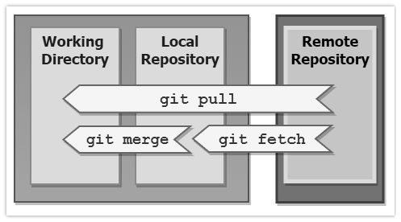

# Git
* [What is Git](#what-is-git)
* [Git vs GitHub vs GitLab](#git-vs-github-vs-gitlab)
* [Basic Git terminology](#basic-git-terminology)
* [Git states](#git-states)
* [Summary](#summary)
* [Setup your practice environment](#setup-your-practice-environment)
* [Practice](#practice)
  * [My first repo](#my-first-repo)

## What is Git?
Git is an open-source command line Version Control System (VCS) originally developed in 2005 by Linus Torvalds (the guy who created Linux os/kernel). There're a few VCS's in the market, but Git has become the clear leader because it's the engine behind many popular source control tools such as Github, Gitlab, Bitbucket. Also, the Git engine works well on a wide range of operating systems and IDEs (Integrated Development Environments). Git helps teams work faster and smarter; it's especially useful for DevOps teams since it helps to reduce development time and increase successful deployments.

Git (also known as source control) is used to track and manage changes to code. Like other version control software, Git keeps track of every modification to code. If a mistake is made, you can turn back the clock and compare earlier versions of the code to help fix the mistake while minimizing disruption to all team members. Git does alot, but here're a few important things to know about Git:

* Git keeps track of every modification to source code
* Git support ability to rollback to previous versions of source code
* Git allows multiple developers to work collaboratively

## Git vs GitHub vs GitLab
You've probably heard of Github or GitLab, and you may even wonder how are they different from Git. Simply put, Git is the engine behind GitHub and GitLab. Both GitHub and GitHub are web-based VCS that've put nice UI ontop the native Git engine. If you want, you can use GitHub or GitLab from the user friendly website (no git commands needed), however if you are a geek like me then you'd prefer the git command line. Git commands are the same regardless if you are using GitHub, GitLab, Bitbucket, or any other VCS running on git. The only thing that is different is the UI, a few terminilogies and functionalities. For example GitHub's CI/CD feature is called 'GitHub Action' where as GitLab's CI/CD is called "GitLab CI'. My advice to you is to learn git commands because their transferrable accros any git-powered VCS.

## Basic Git terminology
Let's get familiar with some common git terms.

* **Repository (repo)**: A Git repository acts as a directory that stores all the content (code, files, images, etc) needed for your project.
* **Init**: `git init` command is used to start tracking a directory, which means it's now a git repo.
* **Clone**: `git clone` command is used to copy a repo.
* **Branch**: A branch is a version of the repo.
* **Checkout**: `git checkout` command is used switch between branches in a repo.
* **Commit**: `git commit` creates a saves modifications made to repo. It essentially crrates a savepoint/napshot of the repo. The latest commit is known as the 'head' of the branch.
* **Merge**: `git merge` command incorporates changes from specified commits into the current branch.
* **Local repo**: Local repos reside on the computers of team members.
* **Remote repo**: Remote repos are hosted on a server accessible for all team members (most likely on the internet or local network).
* **Pull**: `git pull` command grabs changes from a remote repo into the current branch of your local repo.
* **Fetch**: `git fetch` command get changes from a remote repo but it doesn't integrate any of the changes into your working files.
* **Push**: `git push` command updates a remote repo with the commits made to the locl repo.
* **Status**: `git status` command shows the working tree status; what files have been modifed, marked to be saved, and which files aren't being tracked in repo. 

## Git states
Git has three main states that your files can reside in; modified, staged, and committed.

* **Modified**: means that you've made changes to your file but have'nt staged it yet. The modified file is logical place in 'Working Directory'.
* **Staged**: means that you have marked a modified file to be added to your next commit. Staged files are logically placed in 'Staging Area'.
* **Committed**: means that staged file has been successfully saved to git database. Committed files are logicallt placed in 'Git Directory'.

<p align="center"><br/><small><i>image: https://git-scm.com</i></small></p>

## Git pull vs fetch
`git pull` and `git fetch` are very similar (and misleading to some). The key difference between git fetch and pull is that git pull copies changes from a remote repo directly into local repo git working directory, while git fetch does not. The git fetch command only copies changes into your local Git repo. The git pull command does both.

If your workspace has no uncommitted files, and you want to copy the latest changes from a remote repo directly into your local working directory, then issue the git pull command.

If you want to pull down the latest changes from a remote repo without overwriting anything in your working directory, then use git fetch, and then do a git merge when the time is right.

<p align="center"><br/><small><i>image: https://www.theserverside.com</i></small></p>

Fetch is great for getting a fresh view on all the things that happened in a remote repository. Due to it's "harmless" nature, you can rest assured fetch will never manipulate, destroy, or screw up anything. This means you can never fetch often enough.

## Summary
Here's a diagram detailing how each Git commands works to track changes from local to remote repo, then vice-versa.

<p align="center"><br/><small><i>https://community.edyoda.com</i></small></p>

## Setup your practice environment
1. We'll be using GitHub as our remote repo. [Create a GitHub acoount (it's free).](https://github.com/join)
1. We'll be using Git Bash as our emulation layer for Git command line. [Download and install Git Bash (it's free).](https://git-scm.com/downloads)
1. [Setup access and write data in repositories on GitHub.com using SSH.](https://docs.github.com/en/authentication/connecting-to-github-with-ssh/adding-a-new-ssh-key-to-your-github-account)
1. setup your identity (username & email) in Git Bash. This is important because every Git commit uses this information. You need to do this only once if you pass the `--global` option, because then Git will always use that information for anything you do on that system. 
```
# in this example, I'm setting git username to 'Mike Jones'...(please put your GitHub username)
$ git config --global user.name "Mike Jones"

# in this example, I'm setting git email to 'mjones@who.com' ...(please put your GitHub email)
$ git config --global user.email mjones@who.com

# confirm your global git identity on Git Bash has been setup correct
$ git config --global user.name
$ git config --global user.email
```

## Practice

### My first repo
This practice will walk you through creating a remote repo, cloning it locally, modifying the local repo, then pushing modifications form local to remote repo.

**Create your first repo**

Follow the steps in this [doc to create your first repo on GitHub](https://docs.github.com/en/repositories/creating-and-managing-repositories/quickstart-for-repositories). In this example, you'll be using GitHub UI (no git commands needed yet :smirk:)

**Clone remote repo to your local laptop**

In this example, you'll use Git command to clone your remote repo (on GitHub) to your local repo (on your laptop).
* [Obtain the URL for your remote repo (on GitHub)](https://docs.github.com/en/repositories/creating-and-managing-repositories/cloning-a-repository#cloning-a-repository)
* Use the following command to clone remote repo to local
```
# in this example, I'm cloning the repository using an SSH key ...(please put your own repo url)
$ git clone git@github.com:MIKEJONE/hello-world.git

# once clone from remote repo is completed, you should see it on local repo.
$ ls -ltr
```

**Modify file and push changes from local back to remote repo** 

In this example, you'll push changes from local repo to remote repo

```
# navigate to your local repo that was just cloned from remote, modify README.md
# the file (README.md) is now logically in your local git working directory
$ echo -e "# My favorite books\n\n* Meditations (by Marcus Aurelius)" > README>md 

# check the working tree of local repo; see which git state and area each modified file is in
$ git status

# mark the modifications to be added to your next commit
# the file is now logically added to your local git staging area
$ git add README.md

# check the working tree of local repo; see which git state and area each modified file is in
$ git status

# save modified file into git directory with a commit message/description 'adding my favorit books'
# this also creates a savepoint/snapshot of the repo
$ git commit -m 'adding my favorit books'

# check the working tree of local repo; see which git state and area each modified file is in
$ git status

# push the local repo (on laptop) to remote repo (on GitHub)
# after issuing the 'git push' command, naviagte to your GitHub UI to see update
$ git push
```
