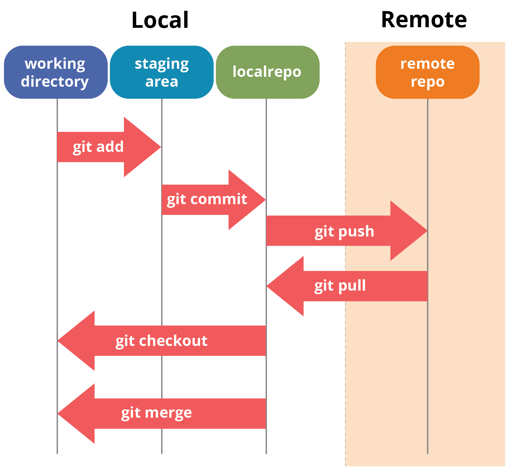

# My first repo
This practice will walk you through:
* creating a remote repo
* cloning remote repo to local repo
* modifying a local repo and pushing the changes to remote repo

**Tools needed**
* [GitHub](https://github.com/join)
* [Git Bash](https://git-scm.com/downloads)
> Launch Git Bash application to run all Git commands

<p align="center"><br/><small><i>image: https://community.edyoda.com</i></small></p>

## 1. Create your first repo**

Follow the steps in this [doc to create your first repo on GitHub](https://docs.github.com/en/repositories/creating-and-managing-repositories/quickstart-for-repositories). In this example, you'll be using GitHub UI (no git commands needed yet :smirk:)

## 2. Clone remote repo to your local laptop

In this example, you'll use Git command to clone your remote repo (on GitHub) to your local repo (on your laptop).
* [Obtain the URL for your remote repo (on GitHub)](https://docs.github.com/en/repositories/creating-and-managing-repositories/cloning-a-repository#cloning-a-repository)
* Run the following command to clone remote repo to local
```
# in this example, I'm cloning the repository using an SSH key ...(please put your own repo url)
$ git clone git@github.com:MIKEJONE/hello-world.git

# once clone from remote repo is completed, you should see it on local repo.
$ ls -ltr
```

## 3. Modify file and push changes from local back to remote repo 

In this example, you'll push changes from local repo to remote repo

```
# navigate to your local repo that was just cloned from remote, modify README.md
# the file (README.md) is now logically in your local git working directory
$ echo -e "# My favorite books\n\n* Meditations (by Marcus Aurelius)" > README>md 

# check the working tree of local repo; see which git state and area each modified file is in
$ git status

# mark the modifications to be added to your next commit
# the file is now logically added to your local git staging area
$ git add README.md

# check the working tree of local repo; see which git state and area each modified file is in
$ git status

# save modified file into git directory with a commit message/description 'adding my favorit books'
# this also creates a savepoint/snapshot of the repo
$ git commit -m 'adding my favorit books'

# check the working tree of local repo; see which git state and area each modified file is in
$ git status

# push the local repo (on laptop) to remote repo (on GitHub)
# after issuing the 'git push' command, naviagte to your GitHub UI to see update
$ git push
```

Navigate to your remote repo (GitHub) and refresh your browser window to confirm that your changes from local repo (laptop) have been successfully push.
